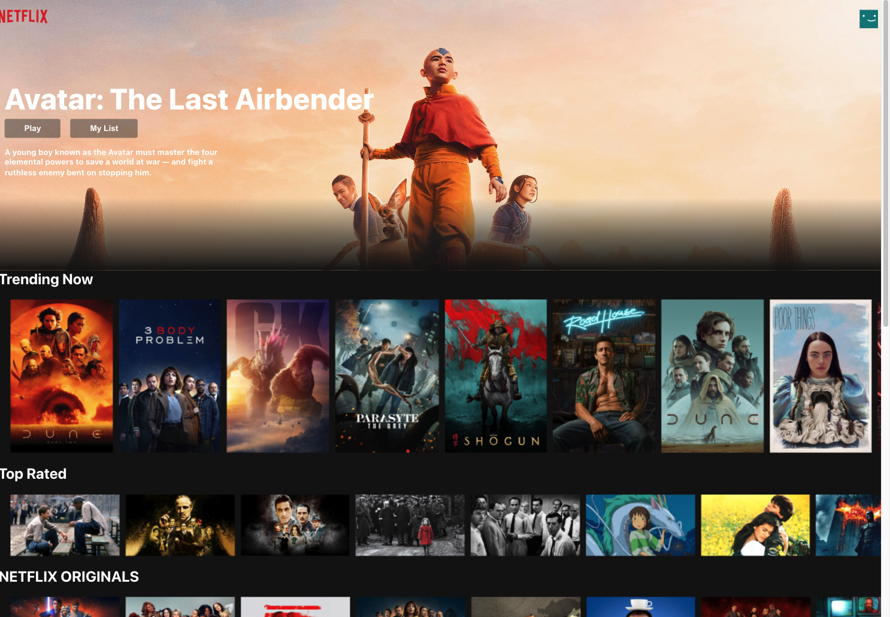

# netflix clone using React and google firebase

[https://netflix-clone-7725c.web.app/]

## To start :

```
git clone https://github.com/Marklin2289/netflix-clone.git

cd netflix-clone

npm install
```



<video src="screenRecord.mp4" controls>
  Your browser does not support the video tag.
</video>
